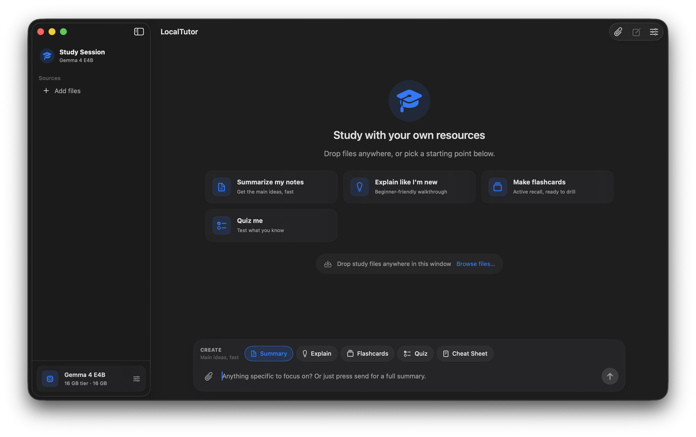

<p align="center">
  
</p>

<h1 align="center">LocalTutor</h1>

<p align="center">
  The easiest way for students to study with their own resources using local AI models — on your Mac, offline, with your files.
</p>

<p align="center">
  <strong>Early preview.</strong> The core study loop is working; more polish and features are on the way.
</p>

---

## Screenshots



_More captures (settings, flashcards, quiz) can be added under [`docs/screenshots/`](docs/screenshots/) when ready._

---

## What it does

LocalTutor is a native macOS app built to feel like a real tutor helping you study — not a generic chat window.

- **Bring your own materials** — Drop or attach PDFs, images, Office/iWork documents, spreadsheets, presentations, and plain text.
- **Study with a local tutor** — Ask questions, get explanations, and refine answers in a focused workspace.
- **Structured study artifacts** — Generate flashcards and quizzes from your sources, with interactive players in the app.
- **Runs on-device** — Models run locally via [MLX Swift](https://github.com/ml-explore/mlx-swift); downloads come from Hugging Face when you choose a model.
- **Memory-aware** — Profiles are grouped for 8 GB and 16 GB Mac tiers, with preflight checks before loading a model.

## Requirements

- **macOS** 26.5 or later (see Xcode deployment target)
- **Apple Silicon** recommended (MLX)
- **Unified memory** — 8 GB minimum for lighter models; 16 GB recommended for stronger multimodal tutors
- **Xcode** 16+ to build from source

## Getting started

1. Clone the repository:

   ```bash
   git clone https://github.com/alan13367/LocalTutor.git
   cd LocalTutor
   ```

2. Open `LocalTutor.xcodeproj` in Xcode.

3. Select the **LocalTutor** scheme and run (**⌘R**).

4. Open **Settings** (**⌘,**) and download a tutor model (first run may take a while depending on model size and network).

5. Attach study files, ask a question, and try generating flashcards or a quiz from your sources.

> **Note:** **Model Lab** exists in the codebase for debugging inference; the shipping UI is the **Study Workspace**.

## Project structure

| Path | Purpose |
|------|---------|
| `LocalTutor/Views/` | SwiftUI — Study Workspace, settings, artifact players |
| `LocalTutor/Services/` | Model runner, Hugging Face I/O, source extraction, memory sampling |
| `LocalTutor/Models/` | Inference profiles, study session and artifact types |
| `LocalTutorTests/` | Unit tests for runner, profiles, and preflight |

## Tech stack

- SwiftUI
- [mlx-swift](https://github.com/ml-explore/mlx-swift) + [mlx-swift-lm](https://github.com/ml-explore/mlx-swift-lm)
- [swift-huggingface](https://github.com/huggingface/swift-huggingface) for model downloads

## License

[MIT](LICENSE) — Copyright (c) 2026 Alan Beltran Pozo
